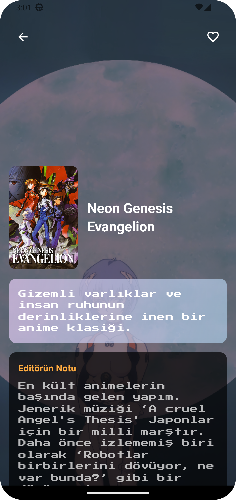
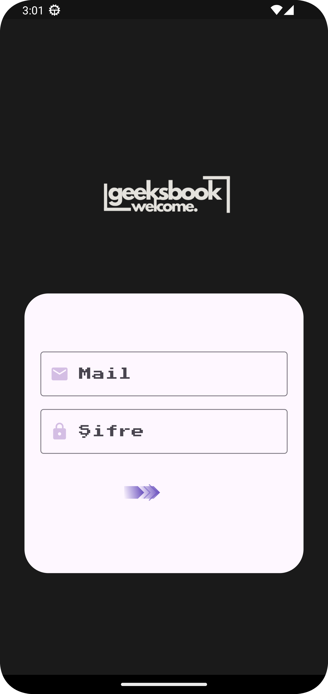
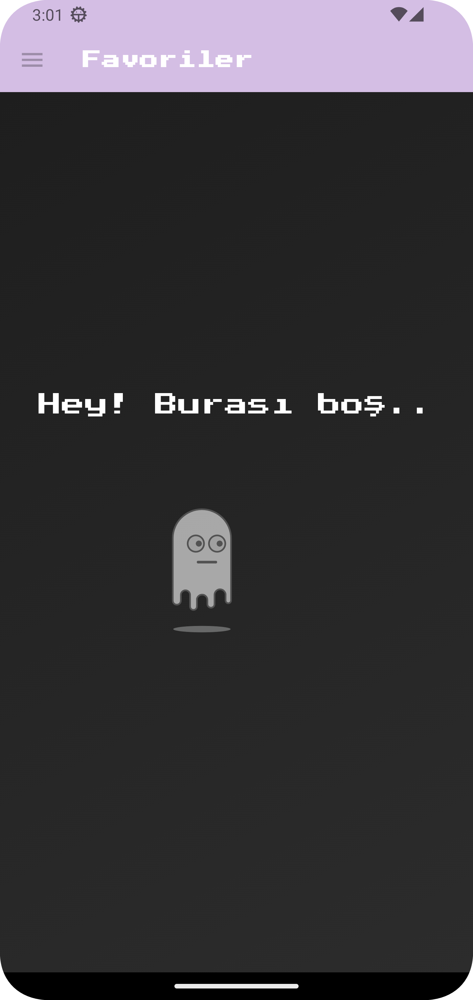
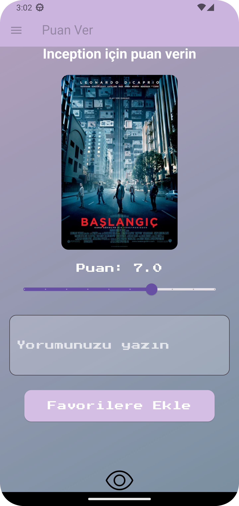
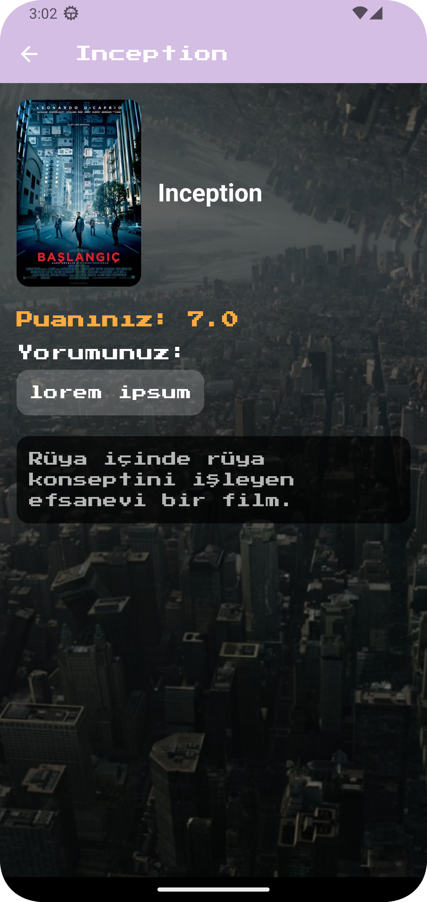

# GeeksBook


## Proje Hakkında

Geek’s Book, kullanıcıların izledikleri film ve dizileri kaydedip puanlayabileceği, yorumlarını paylaşabileceği ve başkalarının listelerine göz
atabileceği bir platformdur.


## Ekibimiz

-  **Danışman:**  
   [https://github.com/keyvanarasteh](Keyvan Arasteh)


-  **Takım Üyeleri:**

- Batuhan Emin Aktaş [GitHub]https://github.com/CiyerSeven


## Özellikler

Sosyal Etkileşim Sistemi | Social Interaction System
Platformumuz, kullanıcılar arasında zengin etkileşim olanakları sunar. Paylaşımlar, yorumlar, beğeniler ve özel mesajlaşma sistemi ile topluluk bağlarını güçlendirir. Kullanıcılar ilgi alanlarına göre gruplar oluşturabilir ve etkinlikler düzenleyebilir.

İçerik Yönetimi | Content Management
Çoklu medya desteği ile kullanıcılar yazı, görsel, video ve bağlantı paylaşabilir. Gelişmiş etiketleme sistemi ve kategoriler ile içerikler düzenli bir şekilde organize edilir. İçerik moderasyon sistemi topluluk standartlarını korur.

Kişiselleştirme | Personalization
Kullanıcılar profillerini özelleştirebilir, ilgi alanlarını belirtebilir ve tercihlerine göre içerik akışlarını düzenleyebilir. Özelleştirilebilir bildirim sistemi önemli güncellemeleri takip etmeyi sağlar.


## Kullanılan Teknolojiler

- Flutter

- Dart

## Başlangıç


### Gereksinimler

- Flutter SDK (sürüm X.X.X)

- Dart SDK (sürüm X.X.X)

### Kurulum Adımları

1. Projeyi bilgisayarınıza indirin:

```bash

git  clone [proje-adresi]

```


2. Proje klasörüne gidin:

```bash

cd [proje-adı]

```


3. Gerekli paketleri yükleyin:

```bash

flutter  pub  get

```


4. Uygulamayı başlatın:

```bash

flutter  run

```


## Proje Yapısı

```

lib/

├── modeller/ # Veri modelleri

├── ekranlar/ # Uygulama ekranları

├── widgets/ # Tekrar kullanılabilir arayüz öğeleri

├── servisler/ # API servisleri

└── yardımcılar/ # Yardımcı fonksiyonlar

```

## Demo Video

#nms-web


https://github.com/user-attachments/assets/9738d9bd-3f00-49f4-8f2e-4edbed2e8842


## Ekran Görüntüleri








## Projeye Katkı Sağlama

1. Projeyi forklayın

2. Yeni bir dal oluşturun (`git checkout -b ozellik/YeniOzellik`)

3. Değişikliklerinizi kaydedin (`git commit -m 'Yeni özellik eklendi'`)

4. Dalınıza gönderin (`git push origin ozellik/YeniOzellik`)

5. Pull Request oluşturun


## Lisans

[Lisans türü] kapsamında lisanslanmıştır. Daha fazla bilgi için `LICENSE` dosyasını inceleyebilirsiniz.


## İletişim

- Proje Bağlantısı: [GitHub repository linki]

- İstinye Üniversitesi: [https://www.istinye.edu.tr/](https://www.istinye.edu.tr/)


## Teşekkürler

- İstinye Üniversitesi'ne destekleri için teşekkür ederiz
